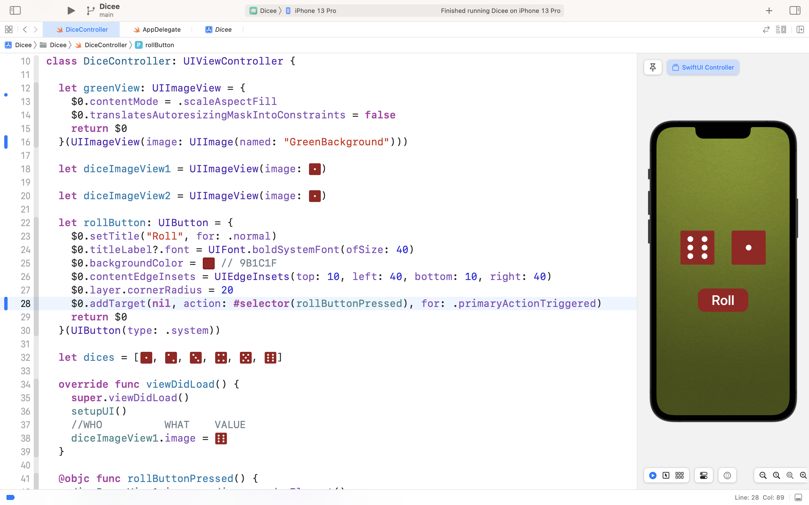

# Dicee

Идея - на начальном view делаем еще одну кнопку, которая ведет на новый экран. 
На новом экране - 5 пунктов, напротив которых появляется соотвествующая цифра. 

Пункты такие
1. Количество бросков
2. Макс Сумма броска
3. Мин сумма броска
4. Следующая сумма броска 
5. Одинаковые кости 

## Our Goal

The objective of this tutorial is to introduce you to the core programming concepts that will form the foundation of most of the apps you’ll build in the future. This app will teach you a lot of important programming knowledge, while building a neat dice app.

## What you will create

We’re going to make a Las Vegas dice app. You can make the die roll at the press of a button or by shaking your phone. With this app in your pocket, you’ll be fully set up to settle any score on the go!

## What you will learn

* How to clone an existing Xcode project from GitHub.
* Create an app with behaviour and functionality.
* Create links between the Interface Builder files and code using IBActions and IBOutlets.
* Get familiar with the Xcode code editor.
* * Learn to use comments to annotate code.
* Understand and use Swift constants and variables.
* Understand and use collection types such as Swift arrays.
* Test and debug your app with the Xcode console.
* Learn about randomisation and how to generate random numbers in Swift.

>This is a companion project to The App Brewery's Complete App Development Bootcamp, check out the full course at [www.appbrewery.co](https://www.appbrewery.co/)

